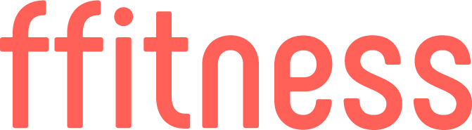
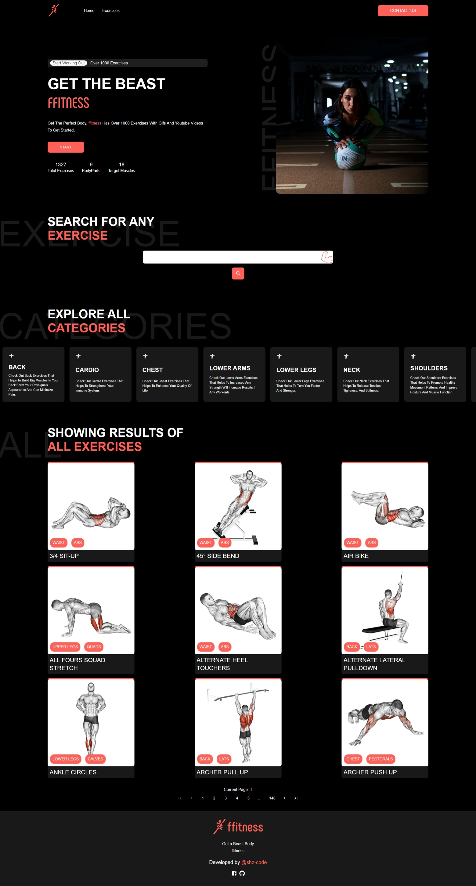

# ffitness | Exercise clone using rapid api | A react app.

Tech & Tools used:

- React js
- React-router-dom
- Material Ui
- Rapid Api

## Features of ffitness

- Over 1000 Exercises with Gifs and Youtube Videos.
- Filter by Search
- Filter By Body Part
- Search any Exercise name, body part
- Responsive design

## Multi Paged Web App

This app contains pages like:

### Home Page

- Hero Section
- Search Bar
- Exercise Category
- All Exercises with pagination

### Exercise Details Page

- Exercise Details
- Related Youtube Videos
- Similar Exercises

# [`ffitness` Website Hosted on Netlify](https://ffitness.netlify.app)

[](https://app.netlify.com/sites/ffitness/deploys)

## Snapshot



## Environment Variables

To run this project, you will need to add the following environment variables to your .env file

`REACT_APP_RAPIDAPI_KEY`

`REACT_APP_RAPIDAPI_HOST`

## Run Locally

Clone the project

```bash
  git clone https://github.com/shz-code/ffitness.git
```

Go to the project directory

```bash
  cd ffitness
```

Install dependencies

```bash
  npm install
```

Start the server

```bash
  npm start
```
Or
```bash
  yarn start
```

## Acknowledgements

- [Main Design is from Dribble](https://dribbble.com/shots/16419594/)
- Rapid Api ([Exercise DB](https://rapidapi.com/justin-WFnsXH_t6/api/exercisedb/)) Api
- Project Idea from [adrianhajdin](https://github.com/adrianhajdin)
